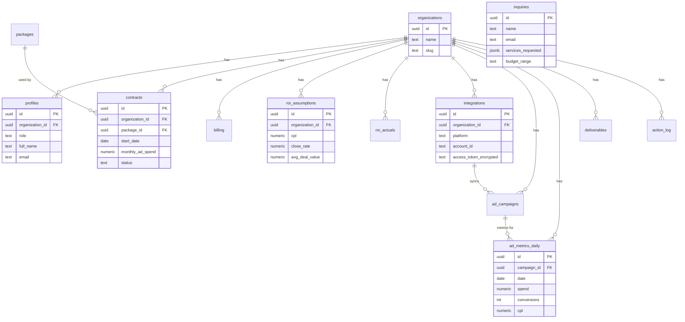

# Cephei Media — Full Website + Client Analytics Portal

## Overview

Build two connected products for Cephei Media, an analytics-first growth agency:

1. **Public marketing website** — premium, dark-themed, conversion-focused landing site with service pages, case studies, and a multi-step intake form.
2. **Client analytics portal** — authenticated SaaS-style dashboard where clients track spend, ROI, campaign performance, deliverables, and growth projections.

Both products live in a single Next.js codebase using route groups to separate public pages from authenticated app/admin routes. A persistent "Client Login" button on the public site bridges the two experiences.

**Tech stack:** Next.js 15 (App Router) + TypeScript + Tailwind CSS v4 + shadcn/ui + Recharts + Supabase (auth, DB, RLS)

---

## Problem Statement / Motivation

Most agencies sell "marketing" with no client visibility into what's running, what was spent, or whether it produced ROI. Cephei differentiates by providing:

- **Measurable outcomes** — every decision backed by data, documented changes, and a clear plan
- **Full visibility** — clients log in to a real dashboard, not a PDF report
- **Two service arms** — DTM (performance marketing) and DDM (brand/design via Haus of BH)

The website must communicate this premium, data-driven positioning. The portal must feel like a real SaaS product, not an afterthought.

---

## Technical Approach

### Architecture

```
cephei-media/
├── public/                          # Static assets, images, fonts
├── src/
│   ├── app/
│   │   ├── (marketing)/             # Route group: public website
│   │   │   ├── layout.tsx           # Marketing layout (navbar + footer)
│   │   │   ├── page.tsx             # Homepage
│   │   │   ├── about/page.tsx
│   │   │   ├── services/
│   │   │   │   ├── page.tsx         # Services overview
│   │   │   │   ├── dtm/page.tsx
│   │   │   │   └── ddm/page.tsx
│   │   │   ├── case-studies/page.tsx
│   │   │   ├── contact/page.tsx
│   │   │   └── insights/page.tsx    # Optional blog shell
│   │   ├── (auth)/                  # Route group: login/signup
│   │   │   ├── layout.tsx           # Minimal auth layout
│   │   │   ├── login/page.tsx
│   │   │   └── forgot-password/page.tsx
│   │   ├── (portal)/               # Route group: authenticated client portal
│   │   │   ├── layout.tsx          # Portal layout (sidebar + topbar)
│   │   │   └── app/
│   │   │       ├── page.tsx        # Client dashboard
│   │   │       ├── roi/page.tsx
│   │   │       ├── campaigns/page.tsx
│   │   │       ├── deliverables/page.tsx
│   │   │       ├── billing/page.tsx
│   │   │       └── contract/page.tsx
│   │   ├── (admin)/                # Route group: admin panel
│   │   │   ├── layout.tsx          # Admin layout
│   │   │   └── admin/
│   │   │       ├── page.tsx        # Admin dashboard
│   │   │       ├── clients/page.tsx
│   │   │       ├── integrations/page.tsx
│   │   │       ├── roi/page.tsx
│   │   │       ├── contracts/page.tsx
│   │   │       └── deliverables/page.tsx
│   │   ├── api/                    # API routes
│   │   │   ├── inquiries/route.ts  # Intake form submission
│   │   │   ├── cron/
│   │   │   │   ├── sync-meta/route.ts
│   │   │   │   └── sync-google/route.ts
│   │   │   └── webhooks/route.ts
│   │   ├── layout.tsx              # Root layout (html, body, fonts, theme)
│   │   └── globals.css
│   ├── components/
│   │   ├── ui/                     # shadcn/ui components
│   │   ├── marketing/              # Public site components
│   │   │   ├── navbar.tsx
│   │   │   ├── footer.tsx
│   │   │   ├── hero.tsx
│   │   │   ├── proof-strip.tsx
│   │   │   ├── service-pillars.tsx
│   │   │   ├── differentiators.tsx
│   │   │   ├── case-study-card.tsx
│   │   │   ├── process-steps.tsx
│   │   │   ├── portal-teaser.tsx
│   │   │   └── intake-form.tsx     # Multi-step form
│   │   ├── portal/                 # Client portal components
│   │   │   ├── sidebar.tsx
│   │   │   ├── kpi-card.tsx
│   │   │   ├── roi-engine.tsx
│   │   │   ├── projection-widget.tsx
│   │   │   ├── campaign-table.tsx
│   │   │   └── deliverables-list.tsx
│   │   └── admin/                  # Admin panel components
│   ├── lib/
│   │   ├── supabase/
│   │   │   ├── client.ts           # Browser Supabase client
│   │   │   ├── server.ts           # Server Supabase client
│   │   │   └── middleware.ts        # Auth middleware helper
│   │   ├── roi-engine.ts           # ROI calculation logic
│   │   ├── projections.ts          # Projection/scenario modeling
│   │   └── utils.ts
│   ├── hooks/                      # Custom React hooks
│   └── types/                      # TypeScript type definitions
├── supabase/
│   └── migrations/                 # SQL migration files
├── middleware.ts                    # Next.js middleware (auth guard)
├── tailwind.config.ts
├── next.config.ts
├── tsconfig.json
└── package.json
```

**Key architectural decisions:**

1. **Route groups** `(marketing)`, `(auth)`, `(portal)`, `(admin)` — each gets its own layout without affecting URL paths. Public pages get navbar+footer; portal gets sidebar+topbar; admin gets admin chrome.

2. **Middleware-based auth** — Next.js middleware checks Supabase session on every request to `/app/*` and `/admin/*`. Unauthenticated users redirect to `/login`. Uses `@supabase/ssr` for cookie-based session handling.

3. **Supabase RLS** — all client data isolated by `organization_id`. RLS policies enforce that clients only see their own org's data. Admin role bypasses org filter. API tokens stored in a server-only table with RLS denying client access.

4. **Server Actions for forms** — the multi-step intake form uses Next.js Server Actions to write to the `inquiries` table and trigger email notifications. No separate API route needed for form submission (but one exists as fallback).

5. **Cron-based ad sync** — Vercel Cron (or Supabase Edge Functions) triggers daily Meta/Google API syncs per client. Tokens stored encrypted, admin-only access.

### Supabase Schema

```sql
-- Core multi-tenancy
CREATE TABLE organizations (
  id UUID PRIMARY KEY DEFAULT gen_random_uuid(),
  name TEXT NOT NULL,
  slug TEXT UNIQUE NOT NULL,
  created_at TIMESTAMPTZ DEFAULT now()
);

CREATE TABLE profiles (
  id UUID PRIMARY KEY REFERENCES auth.users(id),
  organization_id UUID REFERENCES organizations(id),
  role TEXT NOT NULL CHECK (role IN ('client', 'admin')),
  full_name TEXT,
  email TEXT NOT NULL,
  created_at TIMESTAMPTZ DEFAULT now()
);

-- Packages & contracts
CREATE TABLE packages (
  id UUID PRIMARY KEY DEFAULT gen_random_uuid(),
  name TEXT NOT NULL,               -- e.g. "Starter", "Growth", "Scale"
  base_price NUMERIC NOT NULL,
  included_services JSONB,          -- e.g. ["meta_ads","google_ads","seo"]
  portal_access_level TEXT,         -- e.g. "basic", "full", "premium"
  created_at TIMESTAMPTZ DEFAULT now()
);

CREATE TABLE contracts (
  id UUID PRIMARY KEY DEFAULT gen_random_uuid(),
  organization_id UUID REFERENCES organizations(id) NOT NULL,
  package_id UUID REFERENCES packages(id),
  start_date DATE NOT NULL,
  end_date DATE,
  monthly_ad_spend NUMERIC DEFAULT 0,
  extras JSONB DEFAULT '[]',        -- additional line items
  status TEXT DEFAULT 'active' CHECK (status IN ('active','paused','cancelled')),
  created_at TIMESTAMPTZ DEFAULT now()
);

-- Billing
CREATE TABLE billing (
  id UUID PRIMARY KEY DEFAULT gen_random_uuid(),
  organization_id UUID REFERENCES organizations(id) NOT NULL,
  period_start DATE NOT NULL,
  period_end DATE NOT NULL,
  package_amount NUMERIC NOT NULL,
  ad_spend_amount NUMERIC DEFAULT 0,
  extras_amount NUMERIC DEFAULT 0,
  total NUMERIC NOT NULL,
  status TEXT DEFAULT 'pending' CHECK (status IN ('pending','paid','overdue')),
  created_at TIMESTAMPTZ DEFAULT now()
);

-- ROI engine
CREATE TABLE roi_assumptions (
  id UUID PRIMARY KEY DEFAULT gen_random_uuid(),
  organization_id UUID REFERENCES organizations(id) NOT NULL,
  cpl NUMERIC,                      -- cost per lead
  close_rate NUMERIC,               -- e.g. 0.15
  avg_deal_value NUMERIC,
  monthly_leads_target INT,
  notes TEXT,
  updated_at TIMESTAMPTZ DEFAULT now()
);

CREATE TABLE roi_actuals (
  id UUID PRIMARY KEY DEFAULT gen_random_uuid(),
  organization_id UUID REFERENCES organizations(id) NOT NULL,
  period_start DATE NOT NULL,
  period_end DATE NOT NULL,
  total_spend NUMERIC,
  total_leads INT,
  actual_cpl NUMERIC,
  closed_deals INT,
  revenue_generated NUMERIC,
  created_at TIMESTAMPTZ DEFAULT now()
);

-- Ad platform integrations
CREATE TABLE integrations (
  id UUID PRIMARY KEY DEFAULT gen_random_uuid(),
  organization_id UUID REFERENCES organizations(id) NOT NULL,
  platform TEXT NOT NULL CHECK (platform IN ('meta','google')),
  account_id TEXT NOT NULL,
  access_token_encrypted TEXT,      -- server-side only, never exposed
  refresh_token_encrypted TEXT,
  token_expires_at TIMESTAMPTZ,
  last_synced_at TIMESTAMPTZ,
  status TEXT DEFAULT 'active',
  created_at TIMESTAMPTZ DEFAULT now()
);

CREATE TABLE ad_campaigns (
  id UUID PRIMARY KEY DEFAULT gen_random_uuid(),
  organization_id UUID REFERENCES organizations(id) NOT NULL,
  integration_id UUID REFERENCES integrations(id),
  platform TEXT NOT NULL,
  campaign_id TEXT NOT NULL,        -- external platform ID
  campaign_name TEXT,
  status TEXT,                      -- active, paused, etc.
  created_at TIMESTAMPTZ DEFAULT now()
);

CREATE TABLE ad_metrics_daily (
  id UUID PRIMARY KEY DEFAULT gen_random_uuid(),
  organization_id UUID REFERENCES organizations(id) NOT NULL,
  campaign_id UUID REFERENCES ad_campaigns(id),
  date DATE NOT NULL,
  impressions INT DEFAULT 0,
  clicks INT DEFAULT 0,
  spend NUMERIC DEFAULT 0,
  conversions INT DEFAULT 0,
  cpc NUMERIC DEFAULT 0,
  cpl NUMERIC DEFAULT 0,
  ctr NUMERIC DEFAULT 0,
  created_at TIMESTAMPTZ DEFAULT now(),
  UNIQUE(campaign_id, date)
);

-- Deliverables tracking
CREATE TABLE deliverables (
  id UUID PRIMARY KEY DEFAULT gen_random_uuid(),
  organization_id UUID REFERENCES organizations(id) NOT NULL,
  title TEXT NOT NULL,
  description TEXT,
  category TEXT CHECK (category IN ('dtm','ddm','automation','other')),
  status TEXT DEFAULT 'pending' CHECK (status IN ('pending','in_progress','review','completed')),
  due_date DATE,
  completed_at TIMESTAMPTZ,
  created_at TIMESTAMPTZ DEFAULT now()
);

-- Action log (audit trail)
CREATE TABLE action_log (
  id UUID PRIMARY KEY DEFAULT gen_random_uuid(),
  organization_id UUID REFERENCES organizations(id) NOT NULL,
  actor_id UUID REFERENCES auth.users(id),
  action TEXT NOT NULL,             -- e.g. "updated_roi_assumptions", "synced_meta"
  details JSONB,
  created_at TIMESTAMPTZ DEFAULT now()
);

-- Website inquiries (intake form)
CREATE TABLE inquiries (
  id UUID PRIMARY KEY DEFAULT gen_random_uuid(),
  name TEXT NOT NULL,
  email TEXT NOT NULL,
  phone TEXT,
  company TEXT,
  services_requested JSONB,         -- e.g. ["dtm","ddm"]
  budget_range TEXT,                -- e.g. "starter", "growth", "scale"
  project_details TEXT,
  created_at TIMESTAMPTZ DEFAULT now()
);
```

### RLS Policies

```sql
-- Organization isolation: clients see only their org
ALTER TABLE organizations ENABLE ROW LEVEL SECURITY;
CREATE POLICY "Users see own org" ON organizations
  FOR SELECT USING (
    id = (SELECT organization_id FROM profiles WHERE id = auth.uid())
  );

-- Admin sees all orgs
CREATE POLICY "Admins see all orgs" ON organizations
  FOR ALL USING (
    (SELECT role FROM profiles WHERE id = auth.uid()) = 'admin'
  );

-- Apply same pattern to all org-scoped tables:
-- contracts, billing, roi_assumptions, roi_actuals,
-- integrations, ad_campaigns, ad_metrics_daily,
-- deliverables, action_log
-- Pattern:
--   FOR SELECT: organization_id matches user's org OR user is admin
--   FOR INSERT/UPDATE/DELETE: admin only

-- Integrations: tokens are NEVER exposed to clients
-- Additional policy: clients can see integration status but not tokens
CREATE POLICY "Clients see integration status" ON integrations
  FOR SELECT USING (
    organization_id = (SELECT organization_id FROM profiles WHERE id = auth.uid())
  );
-- Token columns excluded via a Postgres VIEW for client queries

-- Inquiries: admin-only read
ALTER TABLE inquiries ENABLE ROW LEVEL SECURITY;
CREATE POLICY "Admins read inquiries" ON inquiries
  FOR SELECT USING (
    (SELECT role FROM profiles WHERE id = auth.uid()) = 'admin'
  );
CREATE POLICY "Anyone can insert inquiry" ON inquiries
  FOR INSERT WITH CHECK (true);  -- public form submission (via server action, anon key)
```

### ERD



---

## Implementation Phases

### Phase 0A: Project Foundation

**Goal:** Scaffold the project, configure tooling, establish the dark premium theme.

**Tasks:**
- [x] Initialize Next.js 15 with App Router, TypeScript, Tailwind CSS v4, ESLint — `package.json`
- [x] Install and configure shadcn/ui with dark theme defaults — `components.json`, `src/app/globals.css`
- [x] Configure Inter/Geist font via `next/font` — `src/app/layout.tsx`
- [x] Define design tokens (CSS variables) for dark theme: near-black bg, charcoal surfaces, white/gray text, subtle borders — `src/app/globals.css`
- [x] Create root layout with font + theme provider — `src/app/layout.tsx`
- [x] Create `(marketing)` route group with layout (navbar + footer) — `src/app/(marketing)/layout.tsx`
- [x] Build responsive Navbar component: logo left, nav links center, "Client Login" + "Book a Call" CTA right — `src/components/marketing/navbar.tsx`
- [x] Build Footer component: quick links, contact, socials, legal — `src/components/marketing/footer.tsx`
- [x] Create placeholder pages for all public routes (`/`, `/about`, `/services`, `/services/dtm`, `/services/ddm`, `/case-studies`, `/contact`) — respective `page.tsx` files
- [x] Set up Supabase project + install `@supabase/supabase-js` and `@supabase/ssr` — `package.json`, `src/lib/supabase/client.ts`, `src/lib/supabase/server.ts`
- [x] Add environment variables for Supabase URL + anon key — `.env.local`
- [ ] Initialize git repository

**Acceptance:**
- Site navigates between all public routes
- Dark premium aesthetic visible on all pages
- "Client Login" visible top-right on every page (links to `/login` placeholder)

---

### Phase 0B: Homepage + Core Marketing Pages

**Goal:** Build the full homepage with all 8 sections, plus service pages and about page.

**Tasks:**

Homepage sections:
- [x] Hero section: headline ("Predictable Growth. Measured ROI."), subheadline, two CTAs, credibility strip — `src/components/marketing/hero.tsx`
- [x] Proof/credibility section: metrics strip or logo bar with placeholder data — `src/components/marketing/proof-strip.tsx`
- [x] Service pillars section: 3 cards (DTM, DDM, Automation) with icons and descriptions — `src/components/marketing/service-pillars.tsx`
- [x] Differentiators section: 4 "why us" cards — `src/components/marketing/differentiators.tsx`
- [x] Case studies section: horizontal carousel or grid of case study cards with placeholder data — `src/components/marketing/case-study-card.tsx`
- [x] Process section: 4-step visual flow (Audit → Build → Optimize → Scale) — `src/components/marketing/process-steps.tsx`
- [x] Portal teaser section: mock dashboard screenshot + copy + CTA — `src/components/marketing/portal-teaser.tsx`
- [x] Intake form section: multi-step form (contact → services → budget → goals → submit) — `src/components/marketing/intake-form.tsx`
- [x] Compose all sections into homepage — `src/app/(marketing)/page.tsx`

Core pages:
- [x] About page: story, team placeholder, Haus of BH partnership mention — `src/app/(marketing)/about/page.tsx`
- [x] DTM service page: definition, channels, deliverables, portal tie-in, CTA — `src/app/(marketing)/services/dtm/page.tsx`
- [x] DDM service page: definition, Haus of BH, services list, deliverables, CTA — `src/app/(marketing)/services/ddm/page.tsx`
- [x] Services overview page: links to DTM + DDM — `src/app/(marketing)/services/page.tsx`
- [x] Case studies page: grid of case study cards with placeholder content — `src/app/(marketing)/case-studies/page.tsx`
- [x] Contact page: embed of multi-step intake form + optional Calendly embed — `src/app/(marketing)/contact/page.tsx`

Motion/polish:
- [x] Add scroll-reveal animations (Intersection Observer or framer-motion) to homepage sections
- [x] Add hover micro-interactions to cards and CTAs
- [x] Ensure responsive layout at mobile/tablet/desktop breakpoints

**Acceptance:**
- Homepage displays all 8 sections with premium dark aesthetic
- All service and about pages populated with placeholder copy
- Multi-step form navigates through all 5 steps
- Responsive on mobile, tablet, desktop

---

### Phase 0C: Conversion Plumbing

**Goal:** Wire intake form to Supabase + email notifications so leads are captured.

**Tasks:**
- [x] Run Supabase migration to create `inquiries` table — `supabase/migrations/001_create_inquiries.sql`
- [x] Create Server Action to insert inquiry into Supabase — `src/app/(marketing)/contact/actions.ts`
- [x] Add form validation with Zod schema — `src/lib/validations/inquiry.ts`
- [x] Send email notification on new inquiry (Resend or Supabase Edge Function) — `src/app/api/inquiries/route.ts` or edge function
- [x] Add success/error states to intake form UI
- [ ] Optional: embed Calendly widget on contact page

**Acceptance:**
- Submitting the intake form creates a row in `inquiries`
- Cephei team receives email notification for new leads
- Validation prevents incomplete submissions

---

### Phase 1: Portal Auth + Foundation

**Goal:** Implement authentication, middleware guards, and portal/admin shell layouts.

**Tasks:**
- [ ] Run Supabase migrations for `organizations`, `profiles` — `supabase/migrations/002_create_orgs_profiles.sql`
- [ ] Build login page with Supabase Auth (email/password) — `src/app/(auth)/login/page.tsx`
- [ ] Build forgot-password page — `src/app/(auth)/forgot-password/page.tsx`
- [ ] Create Next.js middleware for auth: protect `/app/*` and `/admin/*` routes, redirect unauthenticated to `/login` — `middleware.ts`
- [ ] Create Supabase server client with cookie-based session using `@supabase/ssr` — `src/lib/supabase/server.ts`, `src/lib/supabase/middleware.ts`
- [ ] Create `(portal)` route group layout with sidebar navigation — `src/app/(portal)/layout.tsx`
- [ ] Create `(admin)` route group layout with admin sidebar — `src/app/(admin)/layout.tsx`
- [ ] Update marketing navbar: show "Go to Dashboard" when user has active session, "Client Login" when not — `src/components/marketing/navbar.tsx`
- [ ] Role-based redirect after login: `client` → `/app`, `admin` → `/admin` — `src/app/(auth)/login/page.tsx`
- [ ] Set up RLS policies for `organizations` and `profiles` — `supabase/migrations/003_rls_policies.sql`

**Acceptance:**
- `/login` authenticates users via Supabase
- Unauthenticated access to `/app` or `/admin` redirects to `/login`
- Client sees portal shell; admin sees admin shell
- Public site navbar reflects auth state

---

### Phase 2: Client Dashboard + KPIs

**Goal:** Build the client-facing dashboard with key metrics and overview.

**Tasks:**
- [ ] Run migrations for `packages`, `contracts`, `billing` — `supabase/migrations/004_create_packages_contracts_billing.sql`
- [ ] Build KPI card component (spend, CPL, CPC, ROAS, leads) — `src/components/portal/kpi-card.tsx`
- [ ] Build client dashboard page: KPI grid + recent activity — `src/app/(portal)/app/page.tsx`
- [ ] Build billing page: current/past invoices — `src/app/(portal)/app/billing/page.tsx`
- [ ] Build contract page: active contract details — `src/app/(portal)/app/contract/page.tsx`
- [ ] Set up RLS for contracts, billing tables

**Acceptance:**
- Client dashboard shows KPI cards populated from DB
- Billing and contract pages display org-specific data
- RLS prevents cross-org data access

---

### Phase 3: ROI Engine + Projections

**Goal:** Build the ROI analysis page with assumption-based calculations and projection slider.

**Tasks:**
- [ ] Run migrations for `roi_assumptions`, `roi_actuals` — `supabase/migrations/005_create_roi_tables.sql`
- [ ] Implement ROI calculation engine: `(package_cost + ad_spend + extras) × assumptions → projected ROI`; override with actuals when available — `src/lib/roi-engine.ts`
- [ ] Build ROI page with breakdown table and charts (Recharts) — `src/app/(portal)/app/roi/page.tsx`
- [ ] Build projection widget: spend slider → derived CPL, leads, revenue, ROI — `src/components/portal/projection-widget.tsx`
- [ ] Display assumption transparency: show which numbers are assumed vs. actual
- [ ] Set up RLS for ROI tables

**Acceptance:**
- ROI page shows current ROI calculation with transparent assumptions
- Projection slider dynamically recalculates metrics
- Actuals override assumptions when present

---

### Phase 4: Campaign Performance + Ad Sync

**Goal:** Integrate Meta and Google Ads APIs for daily campaign sync.

**Tasks:**
- [ ] Run migrations for `integrations`, `ad_campaigns`, `ad_metrics_daily` — `supabase/migrations/006_create_integrations_ads.sql`
- [ ] Build Meta Ads OAuth flow (admin-initiated) — `src/app/(admin)/admin/integrations/meta/page.tsx`
- [ ] Build Google Ads OAuth flow (admin-initiated) — `src/app/(admin)/admin/integrations/google/page.tsx`
- [ ] Implement Meta Marketing API daily sync (campaigns + metrics) — `src/app/api/cron/sync-meta/route.ts`
- [ ] Implement Google Ads API daily sync — `src/app/api/cron/sync-google/route.ts`
- [ ] Store tokens encrypted, server-side only; create Postgres VIEW excluding token columns for client queries
- [ ] Build campaigns page: table of campaigns with daily metrics, charts — `src/app/(portal)/app/campaigns/page.tsx`
- [ ] Build campaign detail view with time-series charts (Recharts) — performance over time
- [ ] Set up RLS for integrations, campaigns, metrics tables
- [ ] Configure Vercel Cron or Supabase scheduled function for daily sync

**Acceptance:**
- Admin can connect Meta/Google accounts per client org
- Daily sync populates `ad_metrics_daily`
- Client campaigns page shows real synced data
- Tokens never visible to client-role users

---

### Phase 5: Deliverables + Action Log

**Goal:** Build deliverables tracking and audit trail.

**Tasks:**
- [ ] Run migrations for `deliverables`, `action_log` — `supabase/migrations/007_create_deliverables_log.sql`
- [ ] Build deliverables page: list with status filters (pending, in progress, review, completed) — `src/app/(portal)/app/deliverables/page.tsx`
- [ ] Build action log display on dashboard (recent changes) — component in dashboard page
- [ ] Set up RLS for deliverables and action_log

**Acceptance:**
- Client sees their deliverables with current status
- Action log shows recent documented changes
- All data org-isolated via RLS

---

### Phase 6: Admin Panel

**Goal:** Build the internal admin panel for Cephei team to manage all client data.

**Tasks:**
- [ ] Build admin dashboard: overview of all clients, pending items — `src/app/(admin)/admin/page.tsx`
- [ ] Build client management: list/create/edit orgs, invite users — `src/app/(admin)/admin/clients/page.tsx`
- [ ] Build admin integrations page: manage OAuth connections per client — `src/app/(admin)/admin/integrations/page.tsx`
- [ ] Build admin ROI page: set/edit assumptions per client, view all ROI data — `src/app/(admin)/admin/roi/page.tsx`
- [ ] Build admin contracts page: manage contracts, packages — `src/app/(admin)/admin/contracts/page.tsx`
- [ ] Build admin deliverables page: create/update deliverables across clients — `src/app/(admin)/admin/deliverables/page.tsx`
- [ ] Admin can trigger manual ad sync per client
- [ ] Admin can view and manage inquiries from intake form

**Acceptance:**
- Admin has full CRUD over all client data
- Admin can manage integrations, set ROI assumptions, track deliverables
- Admin sees cross-org data; clients remain isolated

---

## Brand & Design Specification

### Design Tokens (CSS Custom Properties)

```css
:root {
  --background: 0 0% 4%;           /* near-black #0a0a0a */
  --foreground: 0 0% 98%;          /* white #fafafa */
  --card: 0 0% 7%;                 /* charcoal #121212 */
  --card-foreground: 0 0% 98%;
  --muted: 0 0% 15%;               /* dark gray */
  --muted-foreground: 0 0% 64%;    /* mid gray text */
  --border: 0 0% 15%;              /* subtle border */
  --primary: 0 0% 98%;             /* white CTA */
  --primary-foreground: 0 0% 4%;   /* black text on white CTA */
  --accent: 0 0% 15%;
  --accent-foreground: 0 0% 98%;
}
```

### Typography
- **Font family:** Inter (via `next/font/google`) or Geist (via `next/font/local`)
- **Hero headlines:** `text-5xl md:text-7xl font-bold tracking-tight`
- **Section headings:** `text-3xl md:text-4xl font-semibold`
- **Body:** `text-base text-muted-foreground`
- **KPI numbers:** `text-4xl font-bold tabular-nums`

### Motion
- Scroll-reveal: fade-up with 0.6s ease, staggered for card groups
- Hover: subtle scale (1.02) + border glow on cards
- Page transitions: fade (optional, via View Transitions API)
- Keep all motion subtle — premium, not playful

---

## Alternative Approaches Considered

| Approach | Considered | Rejected Because |
|----------|-----------|-----------------|
| Separate repos for website + portal | Yes | Shared design system, auth, and types make monorepo simpler |
| Pages Router instead of App Router | Yes | App Router is the standard for Next.js 15; route groups solve the layout problem cleanly |
| Custom auth instead of Supabase Auth | Yes | Supabase Auth + RLS provides auth + authorization + DB in one system |
| Prisma instead of raw Supabase client | Yes | Supabase client works directly with RLS; Prisma bypasses RLS and adds complexity |
| Framer Motion for all animations | Yes | CSS + Intersection Observer sufficient; Framer Motion is optional enhancement |

---

## Acceptance Criteria

### Functional Requirements
- [ ] Public website loads with all pages navigable
- [ ] Homepage displays all 8 sections with premium dark aesthetic
- [ ] Multi-step intake form captures leads to Supabase + sends email notification
- [ ] "Client Login" button visible on all public pages; routes to `/login`
- [ ] Authenticated clients access `/app/*` routes with org-isolated data
- [ ] Authenticated admins access `/admin/*` routes with cross-org data
- [ ] ROI engine calculates projected ROI from assumptions; overrides with actuals
- [ ] Projection widget allows spend slider with derived metric calculations
- [ ] Meta + Google Ads sync daily via cron; data displayed on campaigns page
- [ ] Deliverables tracked with status updates visible to clients
- [ ] Admin can manage all client data, integrations, and ROI assumptions

### Non-Functional Requirements
- [ ] RLS enforced on all org-scoped tables; verified with test queries
- [ ] API tokens (Meta/Google) never exposed to client-role users
- [ ] Responsive design: mobile, tablet, desktop
- [ ] Lighthouse performance score > 90 on public pages
- [ ] TypeScript strict mode; no `any` types
- [ ] All environment secrets in `.env.local`, never committed

### Quality Gates
- [ ] All Supabase migrations run cleanly
- [ ] RLS policies tested: client A cannot see client B's data
- [ ] Intake form submission e2e tested
- [ ] Auth flow tested: login, redirect, session expiry, role-based routing

---

## Edge Cases & Gaps Identified (SpecFlow Analysis)

1. **Session expiry mid-portal-use** — Middleware should catch expired sessions and redirect to `/login` with a return URL so users land back where they were.

2. **Admin creating first client** — Need an onboarding flow: create org → invite user → set package → configure integration. The admin panel should guide this sequence.

3. **No ad data yet for new client** — Campaigns and ROI pages should show empty states with clear messaging ("Connect your ad accounts to see data here") rather than broken charts.

4. **ROI with zero actuals** — Engine must gracefully handle all-assumption state vs. partial actuals vs. full actuals. UI should clearly label which numbers are projected vs. actual.

5. **Intake form abandonment** — Consider saving partial form state to localStorage so users can resume if they navigate away.

6. **Token refresh failure** — If Meta/Google OAuth tokens expire and refresh fails, flag the integration as "needs reconnection" and notify admin. Don't silently fail syncs.

7. **Rate limiting on public form** — Add rate limiting to inquiry submissions to prevent spam (Supabase RLS + server-side check or Vercel middleware).

8. **Mobile portal experience** — Sidebar should collapse to a hamburger menu on mobile. KPI cards should stack vertically.

---

## Dependencies & Prerequisites

- **Supabase project** created with auth enabled
- **Vercel account** for deployment (supports cron jobs)
- **Meta Developer App** with Marketing API access (for Phase 4)
- **Google Ads Developer Token** (for Phase 4)
- **Resend or similar** email service for inquiry notifications (Phase 0C)
- **Domain** configured for production deployment
- **Placeholder content** — copy for DTM/DDM services, case study data, team bios

---

## References

- Next.js App Router: route groups, layouts, middleware auth patterns
- Supabase SSR: `@supabase/ssr` for cookie-based session management in Next.js
- Supabase RLS: organization-based isolation policies using `auth.uid()` → `profiles.organization_id`
- shadcn/ui: component library with dark theme support built on Radix + Tailwind
- Recharts: React charting library for analytics dashboards
